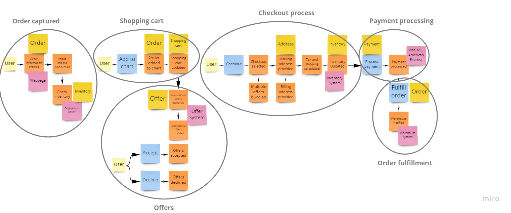

## Оглавление
[[_TOC_]]

## О проекте
Мы проектируем интернет магазин.

## Проблема

## Event Storming


## Решение

## Микросервисы
| BoundedContext                            | Команда       | Сервис                                                                      | Что делает                                |
| -----------                               | -----------   | -----------                                                                 | ----------                                |
| Управление продуктовым каталогом          | Alpha         |[catalog](https://gitlab.com/microarch-ru/minimarket-csharp/catalog)         | Каталог, Товары                           |
| Управление процессом оформлением заказа   | Beta          |[ordering](https://gitlab.com/microarch-ru/minimarket-csharp/ordering)       | Корзина, Оформление, процессинг заказа    |
| Управление процессом сборки и доставки    | Gamma         |[delivery](https://gitlab.com/microarch-ru/minimarket-csharp/delivery)       | Курьеры, Процесс досставки                |
| Управление складом                        | Delta         |[warehouse](https://gitlab.com/microarch-ru/minimarket-csharp/warehouse)     | Корзина, Оформление, процессинг           |
| Управление процессом оплаты               | Omega         |[payment](https://gitlab.com/microarch-ru/minimarket-csharp/payment)         | Списание денег, бонусная программа        |


## Платформенные сервисы и системы
| Назначение                            | Команда       | Приложение                                                           | Что делает                                  |
| -----------                           | -----------   | -----------                                                          | ----------                                |
| Безопасность, контроль доступа        | Core          |[auth](https://gitlab.com/microarch-ru/minimarket-csharp/auth)        | Регистрация, аутентификация, авторизация  |


## Фронтенд
| Назначение                            | Команда       | Приложение                                                                            | Что делает               |
| -----------                           | -----------   | -----------                                                                           | ----------               |
| Витрина интернет магазина             | Core          |[showcase](https://gitlab.com/microarch-ru/minimarket-csharp/front-end/showcase)       | Отображает статус заказа |
| Панель управления интернет магазином  | Core          |[backoffice](https://gitlab.com/microarch-ru/minimarket-csharp/front-end/backoffice)   | Отображает статус заказа |

## Системная архитектура
```plantuml
!include https://raw.githubusercontent.com/plantuml-stdlib/C4-PlantUML/v2.0.1/C4_Component.puml
!include https://raw.githubusercontent.com/plantuml-stdlib/C4-PlantUML/v2.0.1/C4_Container.puml
!include https://gitlab.com/microarch-ru/microservices/dotnet/system-design/-/raw/main/persons.puml

skinparam wrapWidth 200
skinparam maxMessageSize 200

LAYOUT_TOP_DOWN()
LAYOUT_WITH_LEGEND()

' Showcase
System_Boundary(showcase, "Showcase") {
' Person(customer, Покупатель, "Хочет купить продукт")
Container(showcase_app, "Showcase Web", "React", "Витрина интернет магазина")
Container(showcase_bff, "Showcase BFF", "Virtual Ingress Istio, Api Gateway", "Маршрутизация трафика c web приложения Showcase, аутентификацяи, авторизация")
}

' Backoffice
System_Boundary(backoffice, "Backoffice") {
Person(manager, Менеджер, "Управляет интернет магазином")
Container(backoffice_app, "Backoffice Web", "React", "Панель управления интернет магазином")  
Container(backoffice_bff, "Backoffice BFF", "Virtual Ingress Istio, Api Gateway", "Маршрутизация трафика, аутентификацяи, авторизация")
}


' Services
System_Boundary(security, "Security") {
  Container(auth, "Keycloak", "Java", "Сервис управления аутентификацией")
  ContainerDb(auth_db, "Keycloak Database", "Postgress", "Пользователи")
  Rel(auth, auth_db, "read / write", "TCP")
}

System_Boundary(microservices, "Microservices") {
  Container(warehouse, "Warehouse", "Go lang", "Управление складом")
  ContainerDb(warehouse_db, "Warehouse Database", "Postgress", "Товары, остатки")
  Rel(warehouse, warehouse_db, "read / write", "TCP")

  Container(catalog, "Catalog", "Go lang", "Управление каталогом витрины")
  ContainerDb(catalog_db, "Catalog Database", "Postgress", "Товары, цены")
  Rel(catalog, catalog_db, "read / write", "TCP")

  Container(ordering, "Ordering", "Go lang", "Управление процессом оформлением заказа")
  ContainerDb(ordering_db, "Ordering Database", "Postgress", "Продукты, заказы")
  Rel(ordering, ordering_db, "read / write", "TCP")

  Container(payment, "Payment", "Go lang", "Управление процессом оплаты")
  ContainerDb(payment_db, "Payment Database", "Postgress", "Карты, бонусы, финансовые операции")
  Rel(payment, payment_db, "read / write", "TCP")

  Container(delivery, "Delivery", "Go lang", "Управление процессом доставки заказа")
  ContainerDb(delivery_db, "Delivery Database", "Postgress", "Курьеры, маршруты")
  Rel(delivery, delivery_db, "read / write", "TCP")

  ContainerQueue(items_queue, "Items Queue", "RabbitMQ", "Товары, остатки")
  ContainerQueue(delivery_queue, "Delivery Queue", "RabbitMQ", "Задача на доставку")
  ContainerQueue(assembly_queue, "Assembly Queue", "RabbitMQ", "Задача на сборку")

}

' Front -> Auth
Rel_L(showcase_app, auth, "Использует", "HTTPS")
Rel_R(backoffice_app, auth, "Использует", "HTTPS")
Lay_R(showcase,security)
Lay_D(showcase,microservices)

' Actor -> Front
Rel(customer, showcase_app, "Использует", "HTTPS")

' Front -> Api Gateway
Rel(showcase_app, showcase_bff, "Использует", "HTTPS")

' Api Gateway -> Services
Rel(showcase_bff, catalog, "Посмотреть каталог, карточку товара", "HTTP")
Rel(showcase_bff, ordering, "Создать / получить заказ", "HTTP")


' Actor -> Front
Rel(manager, backoffice_app, "Использует", "HTTPS")

' Front -> Api Gateway
Rel(backoffice_app, backoffice_bff, "Использует", "HTTPS")

' Api Gateway -> Services
Rel(backoffice_bff, delivery, "Статус соборки / доставки", "HTTP")
Rel(backoffice_bff, warehouse, "Принять поставку", "HTTP")

' Sync
Rel_R(ordering, payment, "Списать деньги", "gRPC")

' Async
' ordering -> delivery
Rel(ordering, delivery_queue, "Sends customer update events to", "async")   
Rel(delivery_queue, delivery, "Sends customer update events to", "async")

' warehouse -> catalog
Rel(warehouse,  items_queue, "Sends customer update events to", "async")   
Rel(items_queue, catalog, "Sends customer update events to", "async")

' ordering -> warehouse
Rel(ordering, assembly_queue, "Sends customer update events to", "async")   
Rel(assembly_queue, warehouse, "Sends customer update events to", "async")
```

## Варианты использования
```plantuml
left to right direction
skinparam packageStyle rectangle

actor Покупатель
actor Менеджер
actor Кладовщик
actor Курьер

rectangle Minimarket {
  usecase (UC-1 Просмотр каталога продуктов) as UC1
  usecase (UC-2 Посмотр деталей продукта) as UC2
  usecase (UC-3 Добавление продукта в корзину) as UC3
  usecase (UC-4 Удаление продукта из корзины) as UC4
  usecase (UC-5 Оформление заказа) as UC5
  
  usecase (UC-6 Получение статуса заказа)  as UC6
  usecase (UC-7 Отмена заказа)  as UC7

  usecase (UC-8 Сборка заказа)  as UC8
  usecase (UC-9 Доставка заказа)  as UC9
  usecase (UC-10 Приемка товаров на склад)  as UC10

  Покупатель --> UC1
  Покупатель --> UC2
  Покупатель --> UC3
  Покупатель --> UC4
  Покупатель --> UC5
  Покупатель --> UC6

  UC6 <-- Менеджер
  UC7 <-- Менеджер

  UC8<-- Кладовщик
  UC10<-- Кладовщик
  
  UC9<-- Курьер
}
```

- [UC-1](/use-cases/1-viewing-product-catalog.md) Просмотреть каталог продуктов.
- [UC-2](use-cases/2-viewing-product-details.md) Посмотреть детали продукта.
- [UC-3](use-cases/3-adding-product-to-the-cart.md) Добавить продукт в корзину.
- [UC-4](use-cases/4-remove-product-from-shopping-cart.md) Удалить продукт из корзины.
- [UC-5](use-cases/5-make-order.md) Оформить заказ.
- [UC-6](use-cases/6-get-order-status.md) Посмотреть статус заказа.
- [UC-7](use-cases/7-order-cancellation.md) Отменить заказ.
- [UC-8](use-cases/8-order-assembly.md) Собрать заказ.
- [UC-9](use-cases/9-order-delivery.md) Доставить заказ.
- [UC-10](use-cases/10-acceptance-goods-to-warehouse.md) Принять товары на склад.

### Стэйкхолдеры

- **Покупатель** - хочет получить свой заказ.
- **Менеджер** - управляет интернет магазином.
- **Курьер** - собирает и доставляет заказ.
- **Кладовщик** - принимает товары на склад и выдает их курьерам.

