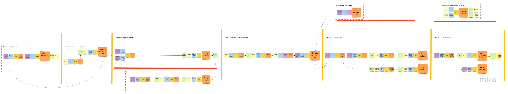

[[_TOC_]]

# О проекте
Это учебный проект.
Целью проекта является демонстрация применения микросервискной архитектуры на практике.
Проект содержит полный путь - от выявляения Bounded Context и до реализации микросервисов.

# Проблема
От CEO нам была поставлена цель - спроектировать интернет магазин с использованием микросервисной архитектуры.
Для этого нам был предоставлен набор User Stories с описанием бизнеса компании, а также макеты интерфейса для лучшего понимания задачи.

Наша задача - провести декомпозицию системы на микросервисы и реализовать их в коде.

# Решение

## Event Storming
Для выявления границ микросервисов мы приняли решение использовать практику Event Storming.
После проведения Event Storming мы выделили следующие Bounded Context: 


## Context diagram
После выделения сервисов было принято решение описать архитектуру в виде нотации C4 model.
Данная диаграмма описывает отношение пользователей и системы.
```plantuml
!include https://raw.githubusercontent.com/plantuml-stdlib/C4-PlantUML/master/C4_Context.puml

skinparam wrapWidth 200
skinparam maxMessageSize 200

LAYOUT_TOP_DOWN()
LAYOUT_WITH_LEGEND()

Person(customer, Покупатель, "Совершает покупки")

System_Boundary(shop_boundary, "Shop") {
Person(manager, Менеджер, "Управляет интернет магазином")
Person(courier, Курьер, "Доставляет заказ")

' Shop
System(shop, "Shop", "Интернет магазин")
Rel_D(customer, shop, "Делает покупки")
Rel_L(manager, shop, "Управляет магазином")
Rel(shop, courier, "Назначает заказ")

' Auth
System_Ext(auth, "Auth", "Сервер аутентификации")
Rel_L(shop, auth, "Использует")
Rel_L(customer, auth, "Авторизуется")
}
```

## Container diagram
Данная диаграмма описывает взаимодействие пользователей и ИТ систем.
Микросервисы сгруппированы.
```plantuml
!include https://raw.githubusercontent.com/plantuml-stdlib/C4-PlantUML/master/C4_Container.puml
' Components
!define actors https://gitlab.com/microarch-ru/microservices/system-design/-/raw/main/containers/actors
!define frontends https://gitlab.com/microarch-ru/microservices/system-design/-/raw/main/containers/frontends  
!define services https://gitlab.com/microarch-ru/microservices/system-design/-/raw/main/containers/services

skinparam wrapWidth 200
skinparam maxMessageSize 200

LAYOUT_TOP_DOWN()
LAYOUT_WITH_LEGEND()

Person(customer, Покупатель, "Совершает покупки")
Person(manager, Менеджер, "Управляет интернет магазином")
Person(courier, Курьер, "Доставляет заказ")
System_Boundary(shop, "Shop") {
' Shop
Container(shop_app, "Shop", "Web, React", "Витрина интернет магазина")
Container(shop_bff, "Shop BFF", "Api Gateway, Ocelot", "Маршрутизация трафика c web приложения shop, аутентификацяи, авторизация")
Rel(shop_app, shop_bff, "Использует", "HTTPS")
Rel(customer, shop_app, "Делает покупки", "HTTPS")

' Backoffice
Container(backoffice_app, "Backoffice", "Web, React", "Панель управления интернет магазином")  
Container(backoffice_bff, "Backoffice BFF", "Api Gateway, Ocelot", "Маршрутизация трафика, аутентификацяи, авторизация")
Rel(backoffice_app, backoffice_bff, "Использует", "HTTPS")
Rel(manager, backoffice_app, "Управляет интернет магазином", "HTTPS")

' Сourier App
Container(courier_app, "Courier App", "Mobile, React Native", "Приложение курьера")  
Container(courier_bff, "Courier BFF", "Api Gateway, Ocelot", "Маршрутизация трафика, аутентификацяи, авторизация")
Rel_L(courier_app, courier_bff, "Изменить статус доставки", "HTTPS")
Rel_L(courier, courier_app, "Изменить статус доставки", "HTTPS")

Container(microservices, "Microservices", "Docker", "Группа микросервисов")
Rel(shop_bff, microservices, "Использует", "HTTPS")
Rel(backoffice_bff, microservices, "Использует", "HTTPS")
Rel_L(courier_bff, microservices, "Использует", "HTTPS")

' Services
Container_Ext(auth, "Auth", "Keycloak, Java", "Сервер аутентификации")
Rel_R(shop_app, auth, "Аутентифициуется", "HTTPS")
Rel_L(backoffice_app, auth, "Аутентифициуется", "HTTPS")
Rel_L(courier_bff, auth, "Аутентифициуется", "HTTPS")
}
```

### Микросервисы
```plantuml
!include https://raw.githubusercontent.com/plantuml-stdlib/C4-PlantUML/master/C4_Container.puml
' Components
!define actors https://gitlab.com/microarch-ru/microservices/system-design/-/raw/main/containers/actors
!define frontends https://gitlab.com/microarch-ru/microservices/system-design/-/raw/main/containers/frontends  
!define services https://gitlab.com/microarch-ru/microservices/system-design/-/raw/main/containers/services

skinparam wrapWidth 200
skinparam maxMessageSize 200

LAYOUT_TOP_DOWN()
LAYOUT_WITH_LEGEND()

Person(customer, Покупатель, "Совершает покупки")
Person(manager, Менеджер, "Управляет интернет магазином")
Person(courier, Курьер, "Доставляет заказ")

System_Boundary(microservices, "Microservices") {
  Container(basket, "Basket", "Docker", "Управление процессом оформления заказа")
  Rel(customer, basket, "Делает заказ", "HTTPS")  

  Container(warehouse, "Warehouse", "Docker", "Управление складом")
  Rel_R(basket, warehouse, "Cоздан новый заказ", "Async, Kafka")
  Rel(manager, warehouse, "Поставки, изменение остатков", "HTTPS")

  Container(catalog, "Catalog", "Docker", "Управление каталогом витрины")
  Rel(warehouse, catalog, "Товары, остатки", "Async, Kafka")
  Rel(customer, catalog, "Витрина, карточка товара", "HTTPS")
  Rel(manager, catalog, "Изменение цен и описания", "HTTPS")

  Container(payment, "Payment", "Docker", "Управление процессом оплаты")
  Rel(basket, payment, "Оплата заказа", "Sync, gRPC")

  Container(delivery, "Delivery", "Docker", "Управление процессом доставки заказа")
  Rel(basket, delivery, "Cоздан новый заказ", "Async, Kafka")
  Rel(manager, delivery, "Получить статус доставки", "HTTPS")
  Rel(delivery,courier,"Назначает заказ")
}
```

## Use case diagram
```plantuml
left to right direction
skinparam packageStyle rectangle

actor Покупатель as client
actor Менеджер as manager
actor Курьер as courier

rectangle System {
  ' auth
  usecase (Аутентифицироваться) as UC1
  usecase (Выйти) as UC2
  ' catalog
  usecase (Просмотр каталога продуктов) as UC3
  usecase (Посмотр карточки продукта) as UC4
  usecase (Изменение цены, описания продукта) as UC5
  ' delivery
  usecase (Получение статуса доставки) as UC6
  usecase (Изменение статуса заказа на 'Доставлен') as UC7
  usecase (Назначение заказа) as UC8
  
  ' basket
  usecase (Добавление товара в корзину) as UC9
  usecase (Удаление товара из корзины) as UC10
  usecase (Просмотр списка товаров в корзине) as UC11
  usecase (Добавление адреса доставки) as UC12
  usecase (Оплата заказа) as UC13

  ' warehouse
  usecase (Принять поставку) as UC14
}

client --> UC1
UC1 <-- manager
UC1 <--courier

client --> UC2
UC2 <-- manager
UC2 <--courier

client --> UC3
UC3 <-- manager

client --> UC4
UC4 <-- manager

UC5 <-- manager

client --> UC6
UC6 <-- manager

UC7 <--courier
UC8 --> courier

client --> UC9
client --> UC10
client --> UC11
client --> UC12
client --> UC13

UC14 <-- manager
```

# Системы
## Микросервисы
| Bounded Context                           | Команда       | Сервис                            | Репозиторий                                                              | Что делает                                |
| -----------                               | -----------   | -----------                       | -----------                                                              | ----------                                |
| Управление продуктовым каталогом          | Alpha         | [catalog](services/catalog)       |[Gitlab](https://gitlab.com/microarch-ru/minimarket-csharp/catalog)       | Каталог, Товары                           |
| Управление процессом оформления заказа    | Beta          | [basket](services/basket)      |[Gitlab](https://gitlab.com/microarch-ru/minimarket-csharp/basket)      | Корзина, Оформление, процессинг заказа    |
| Управление процессом сборки и доставки    | Gamma         | [delivery](services/delivery)     |[Gitlab](https://gitlab.com/microarch-ru/minimarket-csharp/delivery)      | Курьеры, Процесс досставки                |
| Управление складом                        | Delta         | [warehouse](services/warehouse)   |[Gitlab](https://gitlab.com/microarch-ru/minimarket-csharp/warehouse)     | Корзина, Оформление, процессинг           |
| Управление процессом оплаты               | Omega         | [payment](services/payment)       |[Gitlab](https://gitlab.com/microarch-ru/minimarket-csharp/payment)       | Списание денег, бонусная программа        |


## Платформенные сервисы
| Назначение                                | Команда       | Сервис                            | Репозиторий                                                              | Что делает                                |
| -----------                               | -----------   | -----------                       | ----------                                                               | ----------                                |
| Безопасность, контроль доступа            | Platform      | [auth](services/auth)             |[Gitlab](https://gitlab.com/microarch-ru/minimarket-csharp/auth)          | Регистрация, аутентификация, авторизация  |


## Фронтенд
| Назначение                                | Команда             | Приложение                            | Репозиторий                                                                           | Что делает                            |
| -----------                               | -----------         | -----------                           | -----------                                                                           | ----------                            |
| Витрина интернет магазина                 | Alpha, Beta         | [shop](front-end/shop)                |[Gitlab](https://gitlab.com/microarch-ru/minimarket-csharp/front-end/shop)             | Каталог, карточка товара, корзина     |
| Панель управления интернет магазином      | Alpha, Gamma, Delta | [backoffice](front-end/backoffice)    |[Gitlab](https://gitlab.com/microarch-ru/minimarket-csharp/front-end/backoffice)      | Управление каталогом, заказами       |
| Приложение курьера                        | Gamma               | [courier](front-end/courier)          |[Gitlab](https://gitlab.com/microarch-ru/minimarket-csharp/front-end/courier)          | Принятие заказов                      |